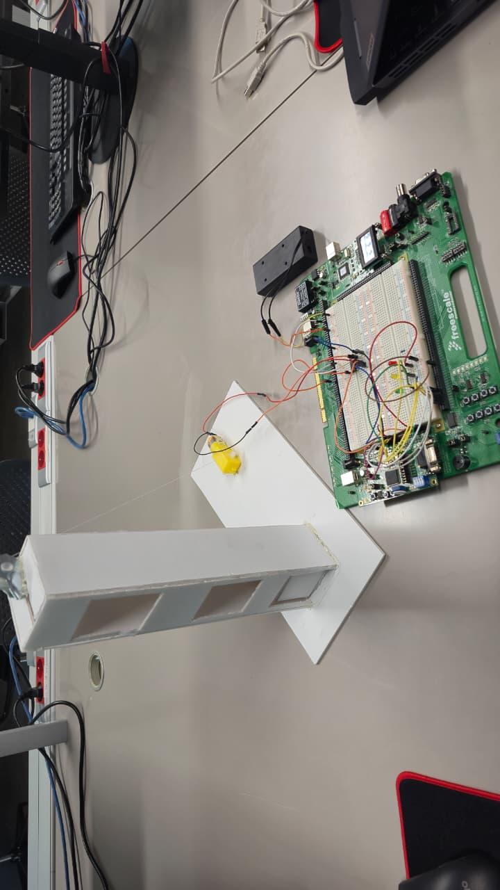

# Elevator System Using a Microprocessor

An elevator system implemented using an assembly-coded microprocessor (Freescale/NXP HCS12 family). The controller is written in HC12 assembly and implements a multi-floor elevator with LED indicators, PWM motor control, LCD messages, and safety checks.

## Microprocessor / MCU
The project targets the **MC9S12DT256** (HCS12) microcontroller. This is specified in the derivative include file:

```assembly name=Sources/derivative.inc url=https://github.com/antoniossaliba/Elevator-System-Using-a-Microprocessor/blob/e7faae4821596e8b7a18202c3b91f7eccafd0f16/Sources/derivative.inc
; include derivative specific macros
INCLUDE 'mc9s12dt256.inc'
```

## Project Structure
- `Sources/main.asm` – Main controller logic (FSM, PWM motor drive, LED/LCD control)
- `Sources/derivative.inc` – MCU include (MC9S12DT256)
- `Project_6.mcp` – CodeWarrior project file
- `bin/` – Build outputs and debug artifacts
- `Prototype/` – Images and demo videos

## How It Works (Logic Overview)
The elevator is implemented as a **finite state machine (FSM)**. The FSM represents elevator states (idle, moving up/down to specific floors, weight alarm). The state variable (`FSM`) is compared in the main loop to decide which sequence to run.

Key FSM meanings are documented directly in the source:

```assembly name=Sources/main.asm url=https://github.com/antoniossaliba/Elevator-System-Using-a-Microprocessor/blob/e7faae4821596e8b7a18202c3b91f7eccafd0f16/Sources/main.asm
FSM         DC.B  0                   ; THIS VARIABLE CONTROLS THE FINITE STATE MACHINE WHICH TELLS ME THE INSTRUCTIONS TO PERFORM
                                      ; $00 --> IDLE
                                      ; $FF --> WEIGHT RESTRICTIONS
                                      ; $01 --> MOVING TO FL1 UP      FORM GF       (FL01)
                                      ; $02 --> MOVING TO FL2 UP                    (FL02)
                                      ; $03 --> MOVING TO FL1 THEN 2                (FL012)
                                      ; $04 --> MOVING TO FL2 UP      FROM FL1      (FL12)
                                      ; $05 --> MOVING TO GF  DOWN                  (FL10)
                                      ; $06 --> MOVING TO FL2 THEN GF               (FL120)
                                      ; $07 --> MOVING TO FL1 DOWN    FROM FL2      (FL21)
                                      ; $08 --> MOVING TO GF  DOWN                  (FL20)
                                      ; $09 --> MOVING TO FL1 THEN GF               (FL210)
```

The main loop checks `FSM` and jumps to the appropriate routine:

```assembly name=Sources/main.asm url=https://github.com/antoniossaliba/Elevator-System-Using-a-Microprocessor/blob/e7faae4821596e8b7a18202c3b91f7eccafd0f16/Sources/main.asm
mainLoop:
            LDAA  FSM
            CMPA  #00
            LBEQ  STP
            CMPA  #$FF                
            LBEQ  ALRM            
            CMPA  #$01
            LBEQ  F01
            CMPA  #$02
            LBEQ  F02            
            CMPA  #$03
            LBEQ  F012            
            CMPA  #$04
            LBEQ  F12            
            CMPA  #$05
            LBEQ  F10            
            CMPA  #$06
            LBEQ  F120            
            CMPA  #$07
            LBEQ  F21            
            CMPA  #$08
            LBEQ  F20
            JMP   F210
```

### Inputs / Outputs (High-Level)
- **Buttons / PORTA**: Used to select floor and movement combinations.
- **PWM channels**: Drive the motor (direction and speed).
- **LEDs**: Indicate movement, alarms, or status.
- **LCD**: Displays textual status (e.g., floor, moving up/down).
- **Potentiometer**: Used as a weight/overload sensor and triggers alarm logic.

## How to Use / Build
1. Open `Project_6.mcp` in **Freescale CodeWarrior for HCS12/HC12**.
2. Ensure the MCU derivative is set to **MC9S12DT256**.
3. Build the project (outputs appear in `bin/`).
4. Flash/load the generated `.s19` file to the HCS12 board.

## Prototype Media

### Prototype Image


### Demo Videos
- [Presentation (MP4)](Prototype/Presentation.mp4)
- [Video 1 (MP4)](Prototype/Video1.mp4)

> If the videos do not play inline on GitHub, click the links to open/download them.

## Notes
- The system is designed around **3 floors**: ground, floor 1, floor 2.
- The FSM ensures deterministic transitions between elevator states.
- Overweight/unsafe conditions trigger a dedicated alarm state.

## License
See [LICENSE](LICENSE).
